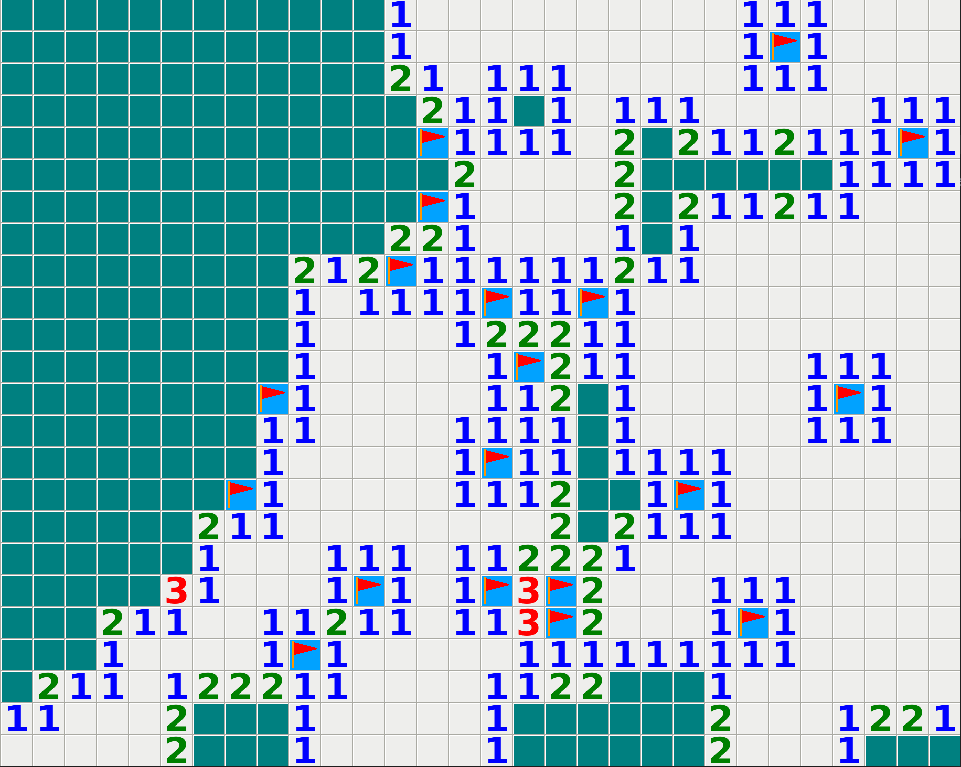

# Minesweeper

The minesweeper game with a solver.

It requires the [pygame](https://www.pygame.org/) library to run.

Usage: `python3 main.py $GRID_WIDTH $GRID_HEIGHT`

Pressing <kbd>Space</kbd> will toggle on and off the solver.

You can use your mouse wheel to zoom in and out of the grid, useful when dealing with a very large grid.
